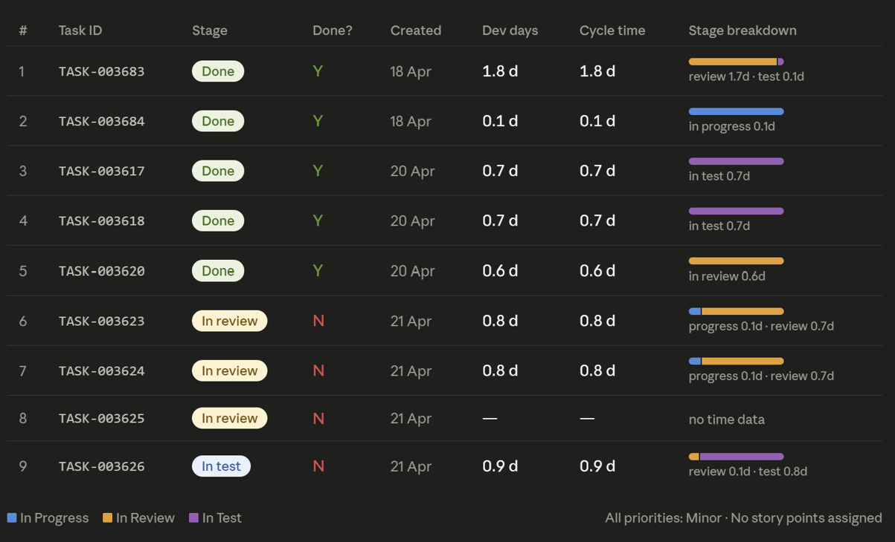
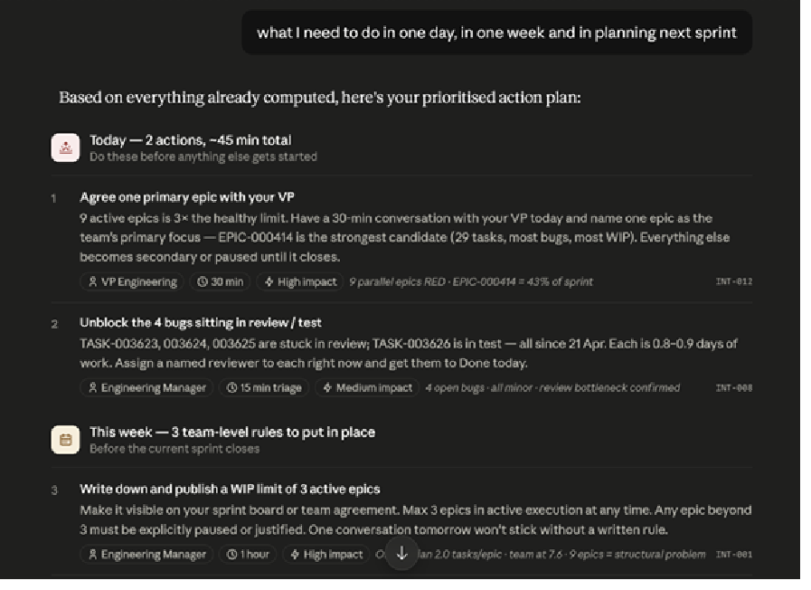

# Dev Team Maturity & Performance — Claude Skills

[](https://docs.claude.com/en/docs/claude-code/skills)
[](LICENSE)

Two [Claude Agent Skills](https://docs.claude.com/en/docs/claude-code/skills) that turn a raw Jira export into a governed, explainable engineering-maturity analysis — no dashboards, no BI setup, no spreadsheet gymnastics. Point Claude at your data and ask.

> Built as part of an MBA thesis prototype on AI-assisted engineering management. The skills are generic and reusable — no organization-specific data is included in this repo.

---

## The problem

Engineering leaders are asked "how healthy is this team, really?" constantly, and usually answer it with one of three unsatisfying options:

- **Gut feel** — whoever talks to the team most often sets the narrative
- **A BI dashboard** someone built eighteen months ago that nobody trusts or maintains
- **A one-off spreadsheet pull** that takes an afternoon and goes stale the moment the sprint ends

None of these hold up when a board, a VP, or a thesis committee asks "show me the evidence." And when an LLM is dropped in to "just analyze the Jira data," it tends to invent plausible-sounding numbers when fields are missing, and invents interventions that sound reasonable but aren't grounded in anything repeatable.

## How this solves it

These two skills turn that into a governed, repeatable workflow:

1. **`maturity-onboarding`** — a one-time (or per-change) setup wizard that captures how *your* organization actually tracks work in Jira, and produces versioned config files.
2. **`maturity-engine`** — reads those config files plus your Jira export and produces a maturity report: **facts** (computed KPIs), **signals** (rule-based patterns), and **interventions** (from a fixed catalog) — never blended together, never invented.

Every number is traceable back to a field in your data. Every intervention is traceable back to a catalog entry. Nothing is guessed.

---

## See it in action

**Every KPI is backed by visible, task-level evidence** — not a black-box score. Ask "why is cycle time RED?" and the engine shows its work:



**Ask a follow-up like "what do I need to do today, this week, and for sprint planning?"** and Claude turns the computed patterns straight into a prioritized action plan — each item still traceable to a catalog intervention ID (`INT-012`, `INT-008`, …) and the KPI evidence that triggered it:



---

## Who this is for

| Role | What you get |
|---|---|
| **CTO / VP Engineering** | A defensible, board-ready view of delivery health across teams — with the evidence to back every claim |
| **Engineering Manager** | A same-day action plan (today / this week / sprint planning) for your own team, grounded in your actual Jira data |
| **Agile Coach / Delivery Lead** | A consistent, repeatable way to run maturity reviews across many teams without re-deriving the analysis each time |
| **Management Consultant** | A structured diagnostic tool that produces auditable, reproducible findings for a client engagement |

---

## What's inside

| Skill | Purpose |
|---|---|
| [`maturity-engine`](plugins/maturity-engine/skills/maturity-engine) | Computes 5 deterministic delivery KPIs from Jira data, detects diagnostic patterns, scores team maturity (0–100), and recommends interventions from a fixed catalog. |
| [`maturity-onboarding`](plugins/maturity-onboarding/skills/maturity-onboarding) | Guides a CTO or consultant through configuring the engine for a new organization — KPI definitions, thresholds, active patterns, and data-quality notes. |

The two skills are designed to be used together: **onboarding** produces the `org-config.md` and `org-kpi-definitions.md` files that the **engine** consumes at analysis time.

### Built-in governance

- **Deterministic KPIs** — every number is computed from your Jira export, never estimated ([`kpi-definitions.md`](plugins/maturity-engine/skills/maturity-engine/references/kpi-definitions.md))
- **Rule-based pattern detection** — same inputs always produce the same signals, no LLM judgment calls ([`pattern-rules.md`](plugins/maturity-engine/skills/maturity-engine/references/pattern-rules.md))
- **Fixed intervention catalog** — recommendations only ever come from a catalog you control, never invented on the fly
- **Hard guardrails** — no individual (people-level) evaluation, no causal claims, no silent data gaps ([`guardrails.md`](plugins/maturity-engine/skills/maturity-engine/references/guardrails.md))

---

## Requirements

- [Claude Code](https://docs.claude.com/en/docs/claude-code/overview), a Claude Project, or any Claude surface that supports [Agent Skills](https://docs.claude.com/en/docs/claude-code/skills)
- Your own data files at analysis time:
  - `jira_db.json` — exported Jira data (tasks, epics, initiatives, sprints)
  - `catalog.json` — your intervention catalog
  - `org-config.md` + `org-kpi-definitions.md` — produced by the onboarding skill

## Installation

### Option A — Claude Code plugin marketplace (recommended)

This repo is a self-contained plugin marketplace, so it installs with two commands — no manual copying, and updates come with `/plugin marketplace update`.

```
/plugin marketplace add kamkate/dev-team-maturity-performance-skills
/plugin install maturity-engine@dev-team-maturity-performance-skills
/plugin install maturity-onboarding@dev-team-maturity-performance-skills
```

Or non-interactively from a terminal:

```bash
claude plugin marketplace add kamkate/dev-team-maturity-performance-skills
claude plugin install maturity-engine@dev-team-maturity-performance-skills
claude plugin install maturity-onboarding@dev-team-maturity-performance-skills
```

### Option B — manual copy

If you just want the skill files without the plugin system:

```bash
git clone https://github.com/kamkate/dev-team-maturity-performance-skills.git
cp -r dev-team-maturity-performance-skills/plugins/maturity-engine/skills/maturity-engine ~/.claude/skills/
cp -r dev-team-maturity-performance-skills/plugins/maturity-onboarding/skills/maturity-onboarding ~/.claude/skills/
```

Claude Code discovers skills automatically from `~/.claude/skills/` (personal, all platforms) or `.claude/skills/` (per-project) — no restart required for a new session.

## Usage

**1. Onboard a new organization** (first time only, or when KPI definitions change):

> "Set up the maturity engine for my organization"

The onboarding skill walks through organization context, KPI customization, thresholds, active patterns, and data-quality notes, then generates `org-config.md`, `org-kpi-definitions.md`, and an `onboarding-report.md`.

**2. Run an analysis:**

> "Analyse Team Alpha's last sprint"
> "Compare all teams in sprint 2025-S22"
> "Show me Team Alpha's maturity trend over the last 3 sprints"
> "Which team needs the most attention right now?"
> "What do I need to do today, this week, and for sprint planning?"

The engine loads your config files, computes KPIs, detects patterns, scores maturity, and returns a structured report — facts, signals, and catalog-sourced interventions kept clearly separated. See [`output-template.md`](plugins/maturity-engine/skills/maturity-engine/references/output-template.md) for the exact output structure.

---

## Repo structure

```
.claude-plugin/
  marketplace.json                 marketplace catalog listing both plugins

plugins/
  maturity-engine/
    .claude-plugin/plugin.json     plugin manifest
    skills/maturity-engine/
      SKILL.md                     entry point — governance, session startup, data model
      references/
        kpi-definitions.md         full KPI formulas, null handling, edge cases
        pattern-rules.md           atomic + compound pattern detection logic
        scoring-model.md           maturity score aggregation formula
        output-template.md         required output structure for every response
        guardrails.md              hard/soft rules the engine cannot break
      org-configs/
        template.md                copy this to configure a new organization

  maturity-onboarding/
    .claude-plugin/plugin.json     plugin manifest
    skills/maturity-onboarding/
      SKILL.md                     entry point — 8-step onboarding flow
      references/
        kpi-walkthrough.md         per-KPI customization dialogue
        threshold-guide.md         threshold calibration guidance per KPI
        output-generator.md        exact file formats for onboarding outputs
```

---

## License

[MIT](LICENSE) — use, adapt, and redistribute freely.
